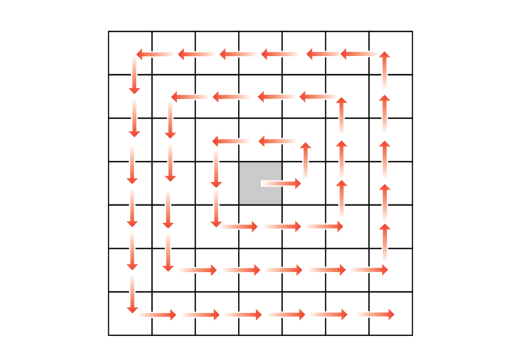
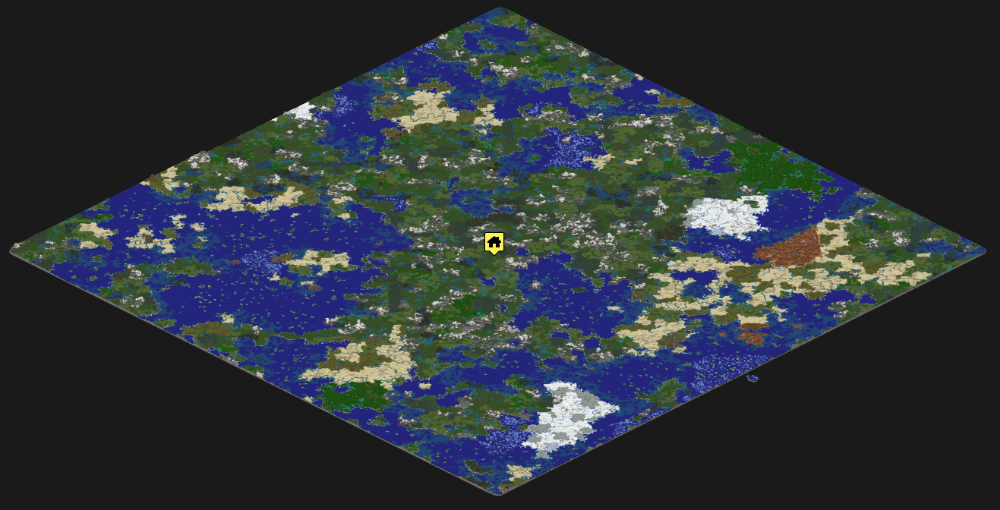

# Minecraft-Map-Revealer
This script will teleport you everywhere following a spiral pattern in order to force terrain generation, can be used to make a map or to prepare a server (performance will be better if geometry has already been generated)

you need to launch the game, be in creative mode (switch from survival to creative with '/gamemode creative') and to be flying (space bar 2 times), because this script will teleport you high up in the sky.
Once the script is launched you have 7 seconds to switch back to the game, then it starts.
To strop it ALT+TAB back to the command line interface where it's running and do CTRL+C (standard behavior to stop python scripts)

If stopped it will automatically resume from the last position

It will move doing a "square spiral"

the delay between teleportations can be reduced if you have a powerfull server.
with a delay of one second I was able to generate the geometry from +7000 to -7000 in 15h

example of a map generated with overviewer :

## additional infos :

 - this works in python 3.7, to make it work in 2.7 you'll just have to change prints to the version without parenthesis
 - you'll need the keyboard package (pip install keyboard)
 - and the teleport command is working with minecraft 1.16.4, don't know if this works with previous versions 
 - don't forget to launch your server with more ram (4GB worked for me) and with no GUI : java -Xmx4096M -Xms4096M  -jar minecraft_server.1.16.1.jar nogui